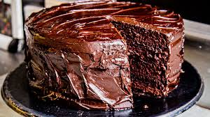
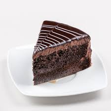

<!DOCTYPE html>
<html lang="es">
<head>
  <meta charset="UTF-8">
  <meta name="viewport" content="width=device-width, initial-scale=1.0">
  <title>Información sobre imagen</title>
  <link rel="stylesheet" href="miestilo.css">
  
</head>
<body>
  <h1>🍰 Receta de Pastel de Chocolate</h1>

  <!-- Imagen que al dar clic muestra la información -->
  

    
  

  <!-- Panel oculto con la información -->
  

    <h2>Receta del Pastel de Chocolate</h2>
    

      Este delicioso pastel se prepara con cacao puro, harina, azúcar, huevos y mantequilla.
      Se hornea por 45 minutos a 180°C y se cubre con betún de chocolate derretido. Ideal para
      celebraciones o postres familiares.
    

    
    <button id="cerrar">Cerrar</button>
  

</body>
</html>
